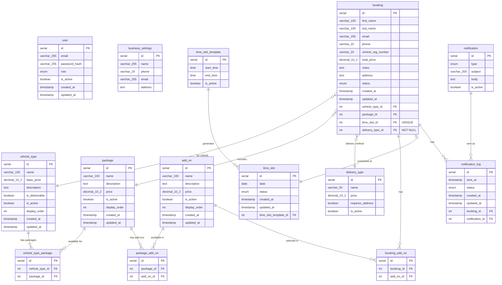

# ERD: Vehicle Care Booking System (V4)

## Entity Relationship Diagram



---

## Entities Summary

| Category | Entity | Description |
|----------|--------|-------------|
| Core | `user` | Admin/Client accounts with role-based access |
| Core | `business_settings` | Business configuration (single row) |
| Catalog | `vehicle_type` | Car, Van, SUV with base pricing |
| Catalog | `package` | Main service packages (Full Wash, Exterior, Interior) |
| Catalog | `add_on` | Optional extras (Polishing, Waxing, etc.) |
| Catalog | `delivery_type` | Delivery options (Bring myself, Pickup) |
| Scheduling | `time_slot_template` | Reusable time slot definitions |
| Scheduling | `time_slot` | Actual bookable slots on specific dates |
| Transaction | `booking` | Customer reservation with all selections |
| Notification | `notification` | Email templates |
| Notification | `notification_log` | Sent notification audit trail |
| Junction | `vehicle_type_package` | Links vehicle types to available packages |
| Junction | `package_add_on` | Links packages to available add-ons |
| Junction | `booking_add_on` | Links bookings to selected add-ons |

---

## Pricing Formula

```
total_price = vehicle_type.base_price
            + package.price
            + SUM(add_on.price for each booking_add_on)
            + delivery_type.price
```

---

## ENUM Values

| Field | Values |
|-------|--------|
| `user.role` | ADMIN, CLIENT |
| `booking.status` | PENDING, CONFIRMED, COMPLETED, CANCELLED_BY_CUSTOMER, CANCELLED_BY_ADMIN |
| `time_slot.status` | AVAILABLE, BOOKED, BLOCKED |
| `notification.type` | BOOKING_CONFIRMATION, BOOKING_MODIFICATION, BOOKING_CANCELLATION |
| `notification_log.status` | PENDING, SENT, FAILED |

---

## Key Constraints

| Constraint | Implementation |
|------------|----------------|
| Exactly 1 package per booking | Direct FK: `booking.package_id` |
| 1 booking per time slot | UNIQUE on `booking.time_slot_id` |
| Delivery always required | NOT NULL on `booking.delivery_type_id` |
| Package-vehicle compatibility | Check via `vehicle_type_package` junction |
| Add-on availability | Check via `package_add_on` junction |
